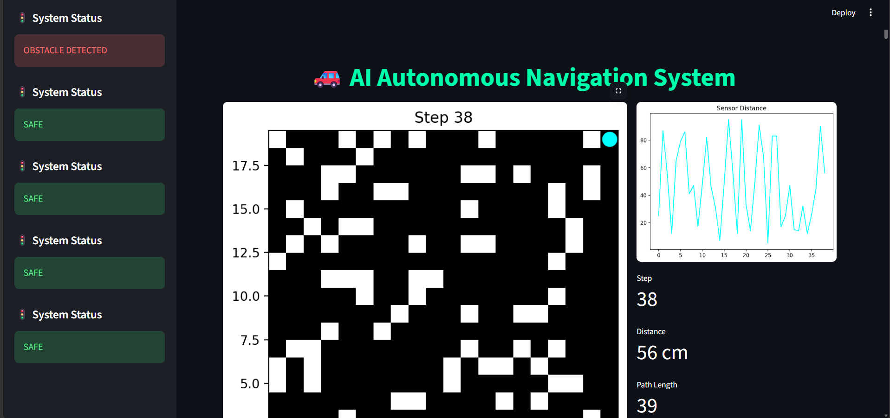

# 🚗 AI-Based Autonomous Navigation System
> **An intelligent robotics simulation implementing A* Path Planning and Real-Time Analytics.**


---

## 📌 Project Overview
This system mimics real-world autonomous navigation. A robot intelligently navigates a dynamic grid environment, avoids obstacles, and reaches a target goal using the **A* Search Algorithm**. The project bridges the gap between path-planning logic and real-time data visualization.

### 🎬 System Demo
| Robot Navigation (Pygame) | Analytics Dashboard (Streamlit) |
| :---: | :---: |
|  |  |


---

## 🚀 Key Features

### 🧠 Intelligent Navigation
* **A* Algorithm:** Optimal pathfinding with heuristic-based search.
* **Obstacle Avoidance:** Real-time sensor simulation to detect and bypass barriers.
* **Dynamic Grid:** Interactive environment that updates as the robot moves.

### 📊 Real-Time Analytics
* **Live Telemetry:** Distance-to-goal tracking and system status logs.
* **Performance Metrics:** Heatmaps showing A* node exploration.
* **Interactive UI:** A Streamlit-powered dashboard for system monitoring.

---

## ⚙️ Tech Stack

| Category | Tools |
| :--- | :--- |
| **Language** | Python 3.11 |
| **Simulation** | Pygame, NumPy |
| **Analytics** | Matplotlib, Streamlit |
| **Algorithm** | A* (A-Star) |

---

### 🖥️ System Architecture
```mermaid
graph LR
    A[Environment] --> B[Perception/Sensors]
    B --> C[A* Path Planning]
    C --> D[Robot Navigation]
    D --> E[Real-Time Visualization]

## 📸 Screenshots

#### 📈 Dashboard & Performance Graphs


#### 🧠 A* Search Heatmap


---

## 🛠️ Installation & Usage

1. **Clone the repository**
   ```bash
   git clone [https://github.com/Vani691/AI-Autonomus-Navigation-System.git](https://github.com/Vani691/AI-Autonomus-Navigation-System.git)
   cd AI-Autonomus-Navigation-System

#### Set up Virtual Environment
```bash
python -m venv .venv
.\.venv\Scripts\activate   
pip install -r requirements.txt
python main.py
streamlit run streamlit_app.py


####🔮 Future Roadmap
[ ] Object Detection: Integrate YOLOv8 for visual obstacle identification.

[ ] RL Integration: Implement Reinforcement Learning for path optimization.

[ ] ROS2: Bridge the simulation with Robot Operating System for hardware deployment.

#### 👨‍💻 Author
Shravani Mane CSE - AIML Engineering Student
