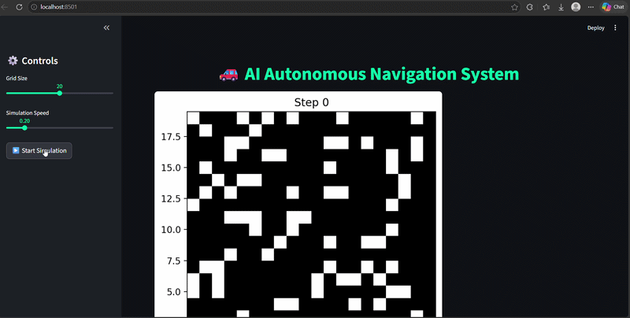
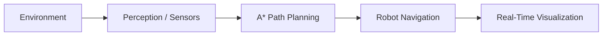
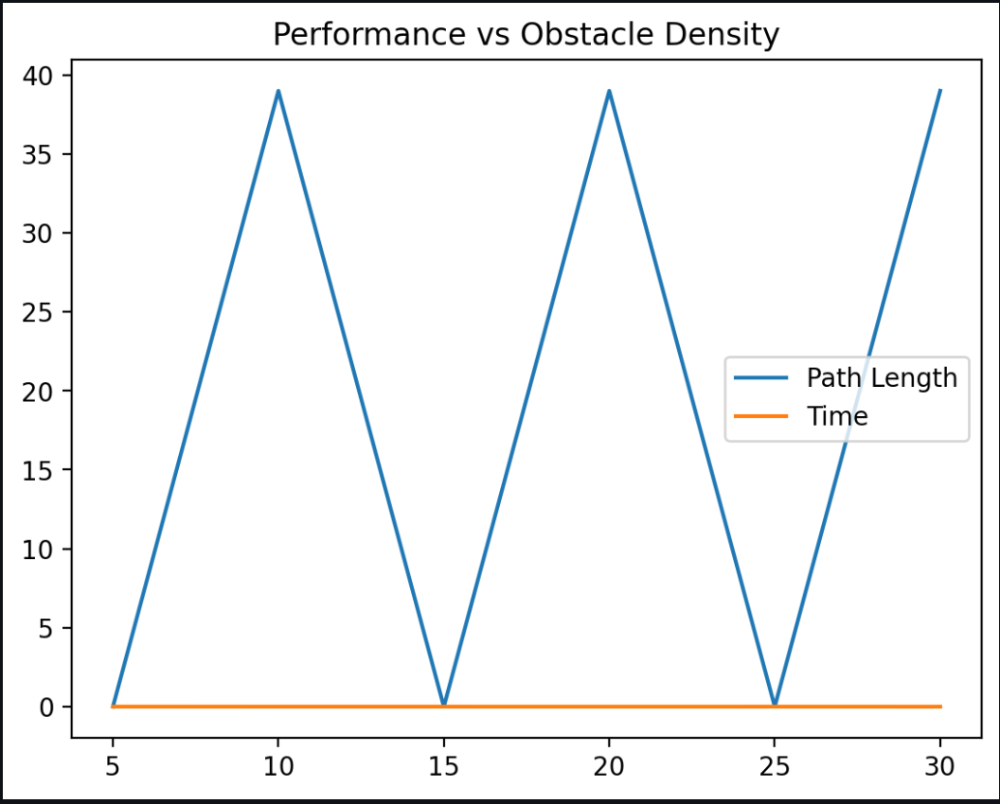
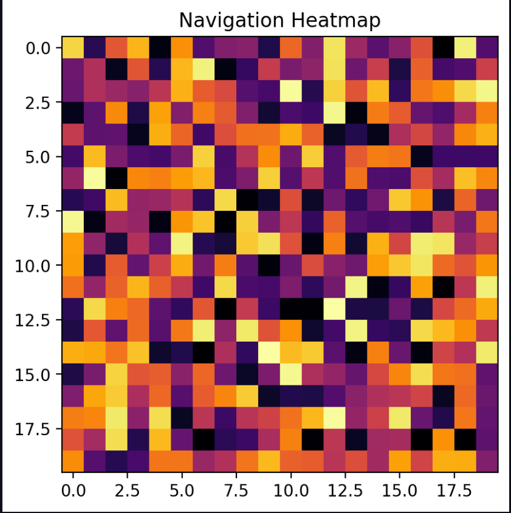

# 🚗 AI-Based Autonomous Navigation System
> **An intelligent robotics simulation implementing A* Path Planning and Real-Time Analytics.**


---

## 📌 Project Overview
This system mimics real-world autonomous navigation. A robot intelligently navigates a dynamic grid environment, avoids obstacles, and reaches a target goal using the **A* Search Algorithm**. The project bridges the gap between path-planning logic and real-time data visualization.

### 🎬 System Demo
| Robot Navigation (Pygame) | Analytics Dashboard (Streamlit) |
| :---: | :---: |
|  | 


---

## 🚀 Key Features

### 🧠 Intelligent Navigation
* **A* Algorithm:** Optimal pathfinding with heuristic-based search.
* **Obstacle Avoidance:** Real-time sensor simulation to detect and bypass barriers.
* **Dynamic Grid:** Interactive environment that updates as the robot moves.

### 📊 Real-Time Analytics
* **Live Telemetry:** Distance-to-goal tracking and system status logs.
* **Performance Metrics:** Heatmaps showing A* node exploration.
* **Interactive UI:** A Streamlit-powered dashboard for system monitoring.

---

## ⚙️ Tech Stack

| Category | Tools |
| :--- | :--- |
| **Language** | Python 3.11 |
| **Simulation** | Pygame, NumPy |
| **Analytics** | Matplotlib, Streamlit |
| **Algorithm** | A* (A-Star) |

---

## 🖥️ System Architecture



---

## 📸 Screenshots

### 📈 Dashboard & Performance Graphs



### 🧠 A* Search Heatmap



---

## 🛠️ Installation & Usage

### 1️⃣ Clone the Repository

```bash
git clone https://github.com/Vani691/AI-Autonomous-Navigation-System.git
cd AI-Autonomous-Navigation-System
```

---

### 2️⃣ Set Up Virtual Environment

#### Windows

```bash
python -m venv .venv
.\.venv\Scripts\activate
```

#### Mac/Linux

```bash
python3 -m venv .venv
source .venv/bin/activate
```

---

### 3️⃣ Install Dependencies

```bash
pip install -r requirements.txt
```

---

### 4️⃣ Run the Project

#### Run Simulation

```bash
python main.py
```

#### Run Dashboard

```bash
streamlit run streamlit_app.py
```

---

## 🔮 Future Roadmap

* [ ] 🎯 Object Detection: Integrate YOLOv8 for obstacle detection
* [ ] 🧠 Reinforcement Learning: Optimize path planning dynamically
* [ ] 🤖 ROS2 Integration: Connect simulation to real robot hardware

---

## 👨‍💻 Author

**Shravani Mane**
CSE - AIML Engineering Student
